<div align="center">

# appstorectl

**Install and export App Store apps from a shell. No interaction on the device.**

[](docs/HOW-IT-WORKS.md)

[](#requirements)
[](#requirements)
[](https://theos.dev)
[](#)

**[How it works](docs/HOW-IT-WORKS.md)** · [Quick start](#quick-start) · [Commands](#commands) · [Gates](#authorization-gates)

</div>

---

```console
$ appstorectl install com.duckduckgo.mobile.ios --force-dismiss --export
[+] com.duckduckgo.mobile.ios  ->  adamId 663592361   (DuckDuckGo, 0 USD, minOS 15.0)
[+] force-dismiss armed (AutoConfirmSheet tweak will answer the sheet)
[+] purchasing com.duckduckgo.mobile.ios (adamId 663592361)
[+] store returned a confirmation with confirmedPaymentUUID; resending
[+] purchased, waiting for install
  progress     43%
  progress     76%
[+] installed: /var/containers/Bundle/Application/11B87D27-.../DuckDuckGo.app
[+] version:   7.234.0 (build 3)  externalVersionId 890112597
[+] sinf        1 of 1 present
[+] encryption  cryptid 1  (off 16384, size 4096)
[+] wrote       com.duckduckgo.mobile.ios_7.234.0_890112597.ipa   178.4 MB
```

Nobody touched the phone. It resolved the bundle id, bought the app on the signed-in Apple ID,
dismissed the confirmation sheet, downloaded ~180 MB, installed it, and packaged it back into an
encrypted `.ipa`.

> [!WARNING]
> **Purchases are real and permanent.** Installing a free app adds it to the Apple ID's purchase
> history. Uninstalling does not undo that. Test with free apps.

> [!TIP]
> **[docs/HOW-IT-WORKS.md](docs/HOW-IT-WORKS.md) is the one to read if you want to understand any of this.** It walks the whole thing end to end: the XPC call into appstored, why three separate things demand a tap, why only one of the two payment sheets can be answered by dismissing it, and how a password prompt that kept coming back turned out to be an account opted into a biometric the device no longer had. Seven diagrams, every claim traced to a binary or an on-device measurement.
>
> The rest of `docs/` is reference material for when you already know what you are looking for.

---

## Quick start

```sh
# 1. build, install, bounce PassbookUIService so the tweak loads
export THEOS=~/theos
make do THEOS_DEVICE_IP=<device-ip>

# 2. one time per Apple ID: allow free downloads without a password
ssh root@<device-ip> 'authpref'                 # if it already says never (3), skip
ssh root@<device-ip> 'authpref free never'      # writes server-side, prompts once

# 3. go
ssh root@<device-ip> 'appstorectl install com.netflix.Speedtest --force-dismiss --export'
```

Step 2 is an **Apple ID** setting, not a device one. A second device on the same account inherits
it, so this is once per account and never again.

---

## Commands

```sh
appstorectl install   <bundle-id> [--force-dismiss] [--export [-o <path>]] [--adam <id>] [-q]
appstorectl export    <bundle-id> [-o <path>]
appstorectl resolve   <bundle-id>
appstorectl uninstall <bundle-id>
appstorectl jobs
authpref              [free|paid never|sometimes|always]
```

| flag | what it does |
|---|---|
| `--force-dismiss` | arms the tweak to answer the confirmation sheet. Required for hands-off |
| `--export` | after installing, package the app as an encrypted `.ipa` |
| `-o <path>` | export destination. Default `/var/jb/tmp/appstorectl-exports/` |
| `--adam <id>` | skip the store lookup and use this adamId |
| `--no-preflight` | skip the biometric pre-flight (see [gates](#authorization-gates)) |
| `-q` | errors only |

> [!CAUTION]
> `resolve` is the safe way to inspect an app: it prints adamId, price and minOS and buys nothing.
> **`install` is not a status check.** For an app that is not installed, it starts a real purchase.

---

## Exporting the IPA

```sh
appstorectl export com.opera.OperaTouch
```
```console
[+] container   /var/containers/Bundle/Application/26C518C3-...
[+] bundle      Opera.app   94.9 MB
[+] sinf        6 of 6 present
[+] encryption  cryptid 1  (off 20480, size 4096)
[+] plugins     Password Extension.appex, NotificationExtension.appex, ...
[+] wrote       com.opera.OperaTouch_6.6.2_887679696.ipa   33.2 MB
[+] sha256      38b3520b56651b45e3bf1b9539461975736d38099d9e16072b287b34adea72e5
```

The output is a **genuine FairPlay-encrypted ipa**, `cryptid 1`. Nothing here decrypts anything.

Layout matches what the store ships:

```
Payload/<App>.app/          including SC_Info/ and _CodeSignature/
iTunesMetadata.plist
```

<details>
<summary><b>Why this reconstructs rather than copies</b></summary>

<br>

A store `.ipa` is **never written to disk**. `IXPromisedStreamingZipTransfer` extracts the archive
while it is still downloading, and `/var/mobile/Media/Downloads/` holds only the queue database.
There is no downloaded file to copy, so export rebuilds the package from the installed container.

It is therefore not byte-identical to Apple's: the zip ordering differs, the `.sinf` is this Apple
ID's (installd rewrites it at install time), and the store already thinned the slice server-side.
It is byte-reproducible run to run.

**Verification is the point.** Every failure mode here is silent, so the run reports what it found:
`SC_Info/Manifest.plist` names one sinf per nested bundle, and all of them are checked. An app with
extensions that exported without their sinfs would otherwise look perfectly fine.

</details>

<details>
<summary><b>Known gaps</b></summary>

<br>

| gap | behaviour |
|---|---|
| On-Demand Resources | asset packs download separately and are never in the bundle. Warned, cannot be fixed |
| Watch apps | untested |
| `iTunesArtwork`, `META-INF/` | not in the container, so absent. Neither is needed for a valid archive |

Disk: staging copies the bundle before zipping, so peak usage is roughly 2x the app size.
Checked up front, and the run refuses rather than failing halfway.

</details>

---

## Requirements

| | |
|---|---|
| **Device** | Jailbroken iOS 15.x or 16.x, rootless |
| **Tested on** | iPhone9,3 · 15.8.1 · 19H380 · palera1n<br>iPhone10,3 · 16.7.12 · 20H364 |
| **Depends** | ElleKit, `com.autopear.installipa`, `zip` |
| **Account** | Signed into the App Store |

<details>
<summary><b>Build targets</b></summary>

<br>

`make do` builds, packages, installs over SSH, then bounces PassbookUIService so the tweak loads.
Set `THEOS_DEVICE_PORT` if you are not on 22 (over `iproxy`, that is 2222).

```sh
export THEOS_DEVICE_IP=<device-ip>
make do                    # build + install
make package               # package only
```

Install by hand, or uninstall:

```sh
scp packages/*.deb root@<device-ip>:/var/jb/tmp/
ssh root@<device-ip> 'dpkg -i /var/jb/tmp/com.appknox.appstorectl_*.deb && killall -9 PassbookUIService'
ssh root@<device-ip> 'dpkg -r com.appknox.appstorectl'
```

</details>

---

## Authorization gates

Three independent things can require interaction. Clearing one produces **no visible change** until
the others are cleared too, which is what makes this confusing to debug.

| # | gate | how it is cleared | manual? |
|:--:|---|---|---|
| 1 | Password for free downloads | `authpref free never` | **once per Apple ID** |
| 2 | Biometric signature | pre-flight clears it automatically | only if biometrics are enrolled |
| 3 | Confirmation sheet | `--force-dismiss` plus the tweak | no |

### Gate 2 in practice

`install` runs a pre-flight that detects an account opted into biometric purchase auth on a device
that has **no enrolled identity**, and clears it. That state arises when a passcode is removed:
Secure Enclave enrolment is wiped, but `+[ISBiometricStore shouldUseAutoEnrollment]` (server driven)
silently re-opts the account in on the next sign-in. The store then demands an `X-Apple-TID-*`
signature that cannot exist, and falls back to asking for your Apple ID password.

The pre-flight only ever clears an opt-in that is **already impossible to satisfy**. On a device
with a working Face ID or Touch ID it does nothing, by design, and you will get a biometric prompt
on every purchase. To go hands-off there, turn off Settings → Face ID & Passcode → **iTunes & App
Store** yourself. Note that auto-enrolment can undo that later; the pre-flight cannot, because a
valid identity is not something to silently disable.

### When a gate is still in place

```console
[-] retry rejected by the store
    domain : AMSErrorDomain
    code   : 6
[-] the store wants the Apple ID password - the sign-in session has expired.
```

That is a gate still standing, not a broken tweak. `install` prints the full server payload,
including `dialogId`, so you can tell which one:

| dialogId | meaning |
|---|---|
| `MZCommerce.ConfirmPaymentSheet` | ordinary confirmation. The tweak handles it |
| `MZCommerce.ConfirmPaymentSheet.Auth` | password demanded. Gate 2 is armed but unsatisfiable |
| `MZCommerce.TID.SignatureRequired` | biometric demanded. Gate 2 is armed and enrolled |

> [!NOTE]
> `authpref` with no arguments is a **read**: safe, no prompt. Passing a value **writes to the
> Apple ID server-side** and prompts for the password once. Do not run the write casually on a
> device that is mid-automation.

---

## How it works

```mermaid
flowchart TD
    A["appstorectl<br/><i>one entitlement</i>"] -->|"ASDPurchase over XPC"| B["appstored"]
    B -->|"buyProduct"| C["itunesstored"]
    C -->|"HTTPS"| D["p&#42;-buy.itunes.apple.com"]
    D -->|"ConfirmPaymentSheet"| E["PassbookUIService"]
    E -.->|"dismissed by<br/>AutoConfirmSheet"| F["confirmedPaymentUUID"]
    F -->|"replayed by appstorectl"| C
    C -->|"download IDs + SINF"| B
    B --> G["installcoordinationd<br/><i>placeholder</i>"]
    B --> H["installd<br/><i>validate + stage</i>"]
    H --> I["installed app"]

    style A fill:#2EA043,color:#fff
    style E fill:#FF6B35,color:#fff
    style I fill:#5865F2,color:#fff
```



> [!IMPORTANT]
> This is **not** another `ipatool`. There is no reimplementation of the store protocol, no HTTP
> client, no credential handling, and no resigning.

It hands an `ASDPurchase` to **appstored** over XPC and lets Apple's own pipeline do the work, the
same path the App Store app's **GET** button takes: Apple ID auth, the anti-fraud device score, the
FairPlay keybag, the SINF, the streaming unzip, LaunchServices registration.

There is exactly **one App Store session** on the device, held by `appstored` and `itunesstored`
(both running as `mobile`). `appstorectl` borrows it; it has no session of its own. The flip side is
that you inherit every refusal the daemon and server make. If the account cannot buy it, neither
can this.

### The two halves

| component | job |
|---|---|
| **`appstorectl`** | resolves a bundle id to an adamId, builds the purchase, watches progress, reports the version installed, packages the result |
| **AutoConfirmSheet** | dismisses one specific dialog so the CLI can run unattended. Alone, it does nothing |

They are coupled by a **single file**. `--force-dismiss` creates `/var/jb/tmp/.autoconfirm` before
purchasing and removes it on every exit path. The tweak checks for that file on every payment sheet
and passes straight through if it is absent. No XPC, no shared state.

<details>
<summary><b>Why a tweak is needed at all</b></summary>

<br>

A purchase ends in a `MZCommerce.ConfirmPaymentSheet` confirmation drawn by **PassbookUIService** as
a PassKit payment-authorization remote alert. It never reaches appstored's dialog delegate, so no
client API can answer it: `notifyDialogCompleteForPurchaseID:` is accepted by the daemon and is a
**no-op** for this sheet. Without something dismissing it, `install` waits until it times out.

The sheet does not need to be *confirmed*, only *dismissed*. The resulting rejection carries a
`confirmedPaymentUUID`, which `appstorectl` replays to complete the purchase silently. That is what
the `resending` line is.

</details>

<details>
<summary><b>The tweak never authorizes anything</b></summary>

<br>

It only ever dismisses, the same outcome as tapping outside the sheet. It **cannot approve a
payment**. Worst case is a cancelled sheet.

Three conditions must all hold before it acts:

1. the process is **PassbookUIService** (bundle filter)
2. the controller is **`PKPaymentAuthorizationRemoteAlertViewController`**
3. **`/var/jb/tmp/.autoconfirm` exists**, true only for the few seconds `appstorectl` is mid-purchase

A real Apple Pay sheet at any other moment is untouched. Verified both ways:

```console
payment sheet appeared while armed - dismissing          # with --force-dismiss
payment sheet appeared but not armed - leaving it alone  # without it
```

Every decision is logged to `/var/jb/tmp/autoconfirm.log`. The dismissal selector differs by iOS
version and is probed at runtime, never hardcoded.

</details>

---

## Troubleshooting

**An install that stalls at `percentComplete -1` with no error.** The app's minimum OS is above the
device. appstored purchases it, creates a placeholder, and the job parks silently. Check `minOS`
with `resolve` first. `appstorectl jobs` inspects; cancelling clears both the job and the
placeholder, leaving no orphan icon.

**A password prompt on every purchase.** Gate 2. See [above](#gate-2-in-practice).

**`zip failed`.** The `zip` package is missing from the bootstrap. It is declared in `Depends`, so
`dpkg -i` should pull it.

**No `/usr/bin/log` on iOS**, so the unified log cannot be streamed on device. The tweak writes to
`/var/jb/tmp/autoconfirm.log` for exactly this reason.

---

## Layout

```
cli/
├── appstorectl.m        purchase, install, dispatch
├── export.m/.h          package an installed app back into an encrypted ipa
├── biometric.m/.h       the gate 2 pre-flight
├── appstorectl.h        the seam shared between the above
├── authpref.m           purchase password settings
├── ASDPrivate.h         private interfaces, annotated
└── entitlements.plist   com.apple.itunesstored.private
tweak/
├── Tweak.x              the dismissal hook
└── AutoConfirmSheet.plist
docs/
├── HOW-IT-WORKS.md      the end-to-end walkthrough, start here
├── PIPELINE.md          how a purchase actually flows
├── GATES.md             the three gates and how each was found
└── FINDINGS.md          the non-obvious details
```

> [!TIP]
> Read [`cli/ASDPrivate.h`](cli/ASDPrivate.h) and [`CLAUDE.md`](CLAUDE.md) before touching either
> tool. They document the things that cost the most to work out, including why every reply block in
> here is declared the way it is.

---

## Notes

Built and verified on **iOS 15.8.1 (19H380)** and **16.7.12 (20H364)**. Private API throughout;
expect it to break on other releases and re-verify before assuming anything still holds.

Tested with FAST Speed Test (~1 MB), DuckDuckGo (180 MB), Firefox and Opera (5 app extensions, 6
sinfs), uninstalled and reinstalled repeatedly, with both the armed and unarmed tweak paths
exercised.
