<div align="center">

# appstorectl

**Buy and install App Store apps from a shell — no interaction on the device.**

[](#requirements)
[](#requirements)
[](https://theos.dev)
[](#)

</div>

---

```console
$ appstorectl install com.duckduckgo.mobile.ios --force-dismiss
[+] com.duckduckgo.mobile.ios  ->  adamId 663592361   (DuckDuckGo, 0 USD, minOS 15.0)
[+] force-dismiss armed (AutoConfirmSheet tweak will answer the sheet)
[+] purchasing com.duckduckgo.mobile.ios (adamId 663592361)
[+] store returned a confirmation with confirmedPaymentUUID; resending
[+] purchased, waiting for install
  progress     2%
  progress     43%
  progress     76%
[+] installed: /var/containers/Bundle/Application/11B87D27-.../DuckDuckGo.app
[+] version:   7.234.0 (build 3)  externalVersionId 890112597
```

Nobody touched the phone. It resolved the bundle id, bought the app on the signed-in Apple ID,
dismissed the confirmation sheet, downloaded ~180 MB and installed it.

---

## What this is not

> [!IMPORTANT]
> This is **not** another `ipatool`. There is no reimplementation of the store protocol, no HTTP
> client, no credential handling, and no `.ipa` to sideload afterwards.

It hands an `ASDPurchase` to **appstored** over XPC and lets Apple's own pipeline do the work — the
same path the App Store app's **GET** button takes. Everything downstream happens exactly as it
normally does: Apple ID auth, the anti-fraud device score, the FairPlay keybag, the SINF, the
streaming unzip, LaunchServices registration.

What lands on disk is a genuine store install — `cryptid = 1`, a freshly written
`SC_Info/<App>.sinf`, a real receipt — not a resigned bundle.

The flip side: you inherit the pipeline's refusals too. If the account cannot buy it, neither
can this.

> [!WARNING]
> **Purchases are real and permanent.** Installing a free app adds it to the Apple ID's purchase
> history. Uninstalling does not undo that.

---

## How it works

```mermaid
flowchart TD
    A["appstorectl<br/><i>one entitlement</i>"] -->|"ASDPurchase over XPC"| B["appstored"]
    B -->|"buyProduct"| C["itunesstored"]
    C -->|"HTTPS"| D["p&#42;-buy.itunes.apple.com"]
    D -->|"ConfirmPaymentSheet"| E["PassbookUIService"]
    E -.->|"dismissed by<br/>AutoConfirmSheet"| F["confirmedPaymentUUID"]
    F -->|"replayed by appstorectl"| C
    C -->|"download IDs + SINF"| B
    B --> G["installcoordinationd<br/><i>placeholder</i>"]
    B --> H["installd<br/><i>validate + stage</i>"]
    H --> I["installed app"]

    style A fill:#2EA043,color:#fff
    style E fill:#FF6B35,color:#fff
    style I fill:#5865F2,color:#fff
```



### The two halves

| component | job |
|---|---|
| **`appstorectl`** | Resolves a bundle id to an adamId, builds the purchase, watches progress, reports the version actually installed |
| **AutoConfirmSheet** | Dismisses one specific dialog so the CLI can run unattended. Alone, it does nothing |

They are coupled by a **single file**. `appstorectl --force-dismiss` creates
`/var/jb/tmp/.autoconfirm` before purchasing and removes it on every exit path. The tweak checks for
that file on every payment sheet and passes straight through if it is absent. No XPC, no shared
state.

<details>
<summary><b>Why a tweak is needed at all</b></summary>

<br>

A purchase ends in a `MZCommerce.ConfirmPaymentSheet` confirmation. It is drawn by
**PassbookUIService** as a PassKit payment-authorization remote alert, and it never reaches
appstored's dialog delegate — so no client API can answer it.
`notifyDialogCompleteForPurchaseID:` is accepted by the daemon and is a **no-op** for this sheet.
Without something dismissing it, `appstorectl install` waits until it times out.

The sheet does not need to be *confirmed*, only *dismissed*. The resulting rejection carries a
`confirmedPaymentUUID`, which `appstorectl` replays to complete the purchase silently. That is what
the `resending` line is.

</details>

<details>
<summary><b>The tweak never authorizes anything</b></summary>

<br>

It only ever calls `dismissWithRemoteOrigination:` — the same outcome as tapping outside the sheet.
It **cannot approve a payment**. The worst case is a cancelled sheet.

Three conditions must all hold before it acts:

1. the process is **PassbookUIService** (bundle filter)
2. the controller is **`PKPaymentAuthorizationRemoteAlertViewController`**
3. **`/var/jb/tmp/.autoconfirm` exists** — true only for the few seconds `appstorectl` is
   mid-purchase

A real Apple Pay sheet at any other moment is untouched. Verified both ways:

```console
payment sheet appeared while armed — dismissing          # with --force-dismiss
payment sheet appeared but not armed — leaving it alone  # without it
```

Every decision is logged to `/var/jb/tmp/autoconfirm.log`.

</details>

---

## Requirements

| | |
|---|---|
| **Device** | Jailbroken iOS 15.x, rootless |
| **Tested on** | iPhone9,3 · 15.8.1 · 19H380 · palera1n |
| **Depends** | ElleKit, `com.autopear.installipa` |
| **Account** | Signed into the App Store |

---

## Build and install

```sh
export THEOS=~/theos
make do THEOS_DEVICE_IP=<device-ip>
```

`make do` builds, packages, installs over SSH, then bounces PassbookUIService so the tweak loads.
Set `THEOS_DEVICE_PORT` too if you are not on 22.

<details>
<summary><b>Other build targets</b></summary>

<br>

Export the IP once and drop the argument:

```sh
export THEOS_DEVICE_IP=<device-ip>
make do
```

Package only, to install by hand:

```sh
make package
scp packages/*.deb root@<device-ip>:/var/jb/tmp/
ssh root@<device-ip> 'dpkg -i /var/jb/tmp/com.appknox.appstorectl_*.deb && killall -9 PassbookUIService'
```

Uninstall:

```sh
ssh root@<device-ip> 'dpkg -r com.appknox.appstorectl'
```

</details>

---

## Usage

```sh
appstorectl install <bundle-id> [--force-dismiss] [--adam <id>] [-q]
appstorectl resolve <bundle-id>      # adamId, price, minOS — no purchase
appstorectl uninstall <bundle-id>
appstorectl jobs                     # in-flight download/install jobs
```

> [!CAUTION]
> `resolve` is the safe way to inspect an app. **`install` is not a status check** — for an app that
> is not installed, it starts a real purchase.

### Authorization gates

Three independent things can require interaction. Clearing one does nothing visible until the
others are cleared too, so work down the table **in order**.

| # | gate | how to clear |
|:--:|---|---|
| 1 | Password for free downloads | `authpref free never` |
| 2 | Biometric signature | Settings → Touch ID & Passcode → iTunes & App Store **off** |
| 3 | Confirmation sheet | `--force-dismiss` (needs the tweak) |

> [!NOTE]
> **Gates 1 and 2 must be cleared before `--force-dismiss` can work.** The tweak dismisses the
> *confirmation* sheet. If a password or biometric check is still required, what appears instead is
> an **auth prompt**, and dismissing that produces no usable `confirmedPaymentUUID` — so the retry
> has nothing to replay:
>
> ```console
> [-] retry rejected — the UUID is probably single-use or cancel-invalidated
> ```
>
> That means a gate above is still in place, not that the tweak is broken. Run `authpref` to check.

```sh
authpref                  # show current settings
authpref free never
authpref free always      # restore
```

The password setting lives on the **Apple ID** and syncs to all your devices — the same one
Settings → Media & Purchases → Password Settings writes. An account that reads as *unset* still
prompts, because unset is treated as `always`.

---

## Recovering a stuck install

An app whose minimum OS is above your device will be **purchased and then stall**: appstored creates
a placeholder and the job parks with `percentComplete -1` and **no error**.

```sh
appstorectl jobs     # inspect
```

Cancelling clears both the job and the placeholder, leaving no orphan icon. Check `minOS` with
`resolve` before installing.

---

## Layout

```
cli/
├── appstorectl.m        the CLI
├── authpref.m           purchase password settings
├── ASDPrivate.h         private interfaces, annotated
└── entitlements.plist   com.apple.itunesstored.private
tweak/
├── Tweak.x              the dismissal hook
└── AutoConfirmSheet.plist
docs/
├── PIPELINE.md          how a purchase actually flows
├── GATES.md             the three gates and how each was found
└── FINDINGS.md          the non-obvious details
```

> [!TIP]
> Read [`cli/ASDPrivate.h`](cli/ASDPrivate.h) before touching either tool. It documents the things
> that cost the most to work out — including why every reply block in here is declared the way it is.

---

## Notes

Built and verified on **iOS 15.8.1 (19H380)**. Private API throughout; expect it to break on other
releases.

Tested with FAST Speed Test (~1 MB), DuckDuckGo (180 MB) and Firefox — uninstalled and reinstalled
repeatedly, with both the armed and unarmed tweak paths exercised.
