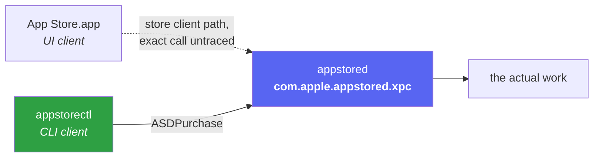
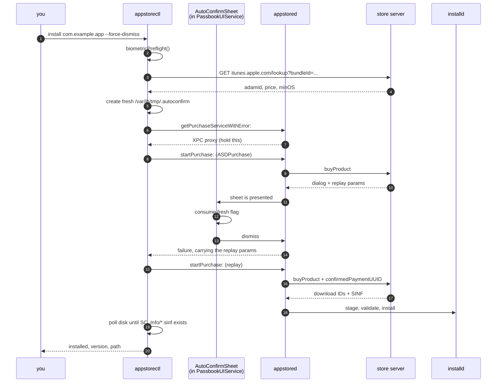
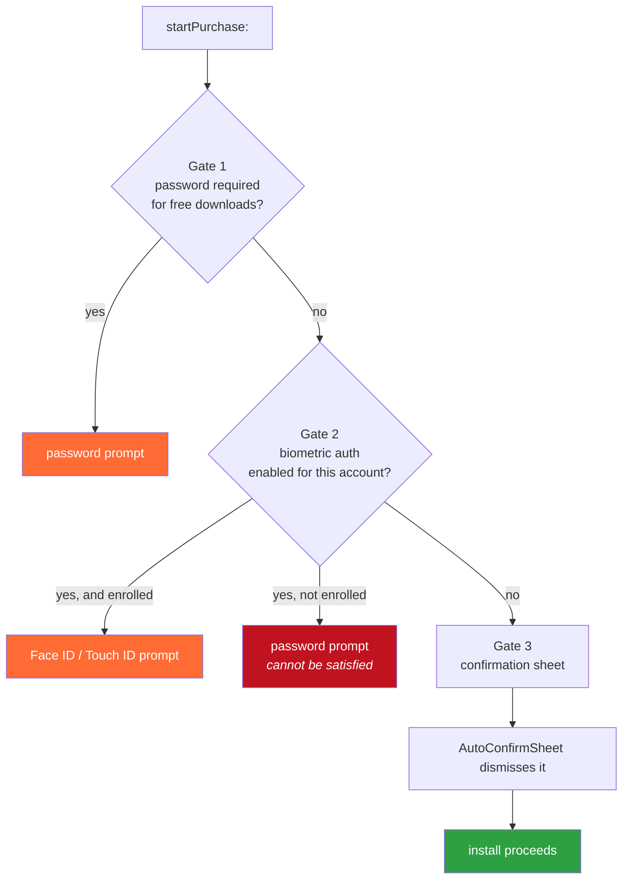
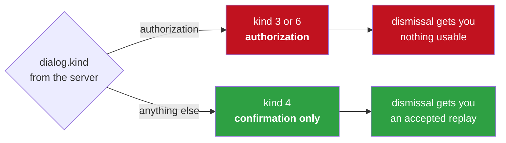
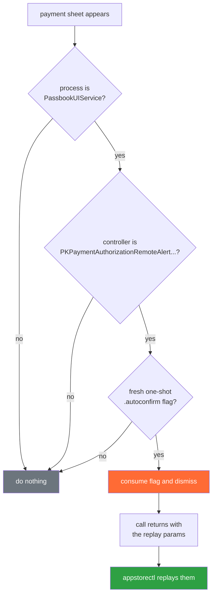
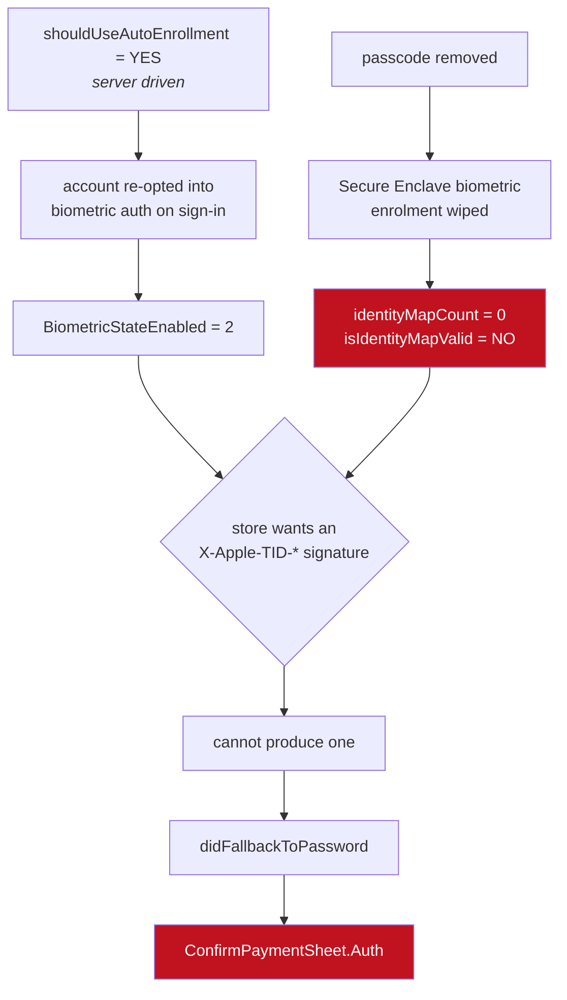

# How appstorectl works

This is a walkthrough of a command line tool that installs free App Store apps on jailbroken iOS through the store's real purchase pipeline, with nothing touching the device, how it works, and what stood in the way.

To be exact about "free", since it shapes everything below. Every request here carries `price=0`, and the account setting that makes it unattended, `freeDownloadsPasswordSetting`, only governs free downloads. The server accepts `free never` and refuses `paid never`, so Apple enforces a floor on paid purchases that this does not attempt to cross. Paid apps are untested. These are still real purchases in every other sense: they go through `buyProduct`, they land in the Apple ID's purchase history, and uninstalling does not undo that.

A note on evidence, because it changes how you should read the rest. Everything here comes from reverse engineering the system binaries or from watching a real device. Where I show a function name and address, I read it. Where I say "observed", it happened in front of me on hardware. Where I am inferring from strong but incomplete evidence, I say so, and there are several places where I do. Addresses are from iOS 15.8.1 (19H380) unless noted. Behaviour marked 16.7.12 is from an iPhone10,3.

I have also left in two conclusions I got wrong and later reversed, because how they were wrong is more useful than pretending I went straight to the answer.

---

## The one idea behind it

The purchase/install path does not implement the App Store purchase protocol, receive credentials, or see your password. It does make one plain HTTP request to Apple, a public metadata lookup, and I will come back to that because it is the one exception. The separate `login` command does handle the password supplied through a file, `APPSTORECTL_PASSWORD`, or its terminal prompt.

What it does instead is build a single object, `ASDPurchase`, and hand it to a daemon called **appstored** over XPC. XPC is Apple's inter-process communication mechanism, so this is a local call to a service already running on the phone rather than anything going out to the network. Everything after that point, the network calls, the FairPlay keybag that holds the decryption keys for purchased apps, the download, the install, is Apple's own pipeline doing what it normally does.

So the mental model is not "a tool that installs apps". It is "a second client for a service that was already running".



How much of that diagram is proven, and how much is inference, is worth being precise about. `AppStore.bin`'s load commands link `AppStoreDaemon.framework`, `AppleMediaServices.framework` and `StoreServices.framework`, the same three the CLI uses, and its only reference to `ASDPurchase` anywhere in 32,000 functions is in purchase history rather than the buy path. That establishes the App Store app is a UI layer over the same client frameworks. It does **not** prove the app constructs an `ASDPurchase` and calls `startPurchase:` the way we do. I did not trace its GET button, and the binary is almost entirely Swift.

What the evidence does support, and what actually matters for the rest of this: **for this purchase path, authentication state is owned by the daemon, not supplied by the client.** The purchase inherits whatever the daemon and the server decide.

---

## One install, start to finish

Here is the real sequence for `appstorectl install <bundle-id> --force-dismiss`. Everything later in this document is a detail hanging off one of these steps, so it is worth having the map first.



Most of that is unremarkable. Four steps are not, and each has a detail the diagram cannot show.

### Resolving the bundle ID

This is the one HTTP request appstorectl makes itself. It hits `https://itunes.apple.com/lookup?bundleId=...`, first with the device's country code and then bare, and reads back `adamId` (Apple's numeric identifier for a store item), the price and the minimum OS version.

It is a public endpoint, unauthenticated, read-only, and no daemon is involved. That is why I said the tool does not implement the purchase protocol rather than that it never talks to Apple. This request is still an Apple HTTP request, it just does not buy anything.

### Building the purchase

`ASDPurchase` comes from `AppStoreDaemon.framework`, which the CLI `dlopen`s at startup. Setting it up looks trivial:

```objc
ASDPurchase *p  = [ASDPurchase new];
p.bundleID      = bundleID;
p.itemID        = adamID;
p.buyParameters = @"salableAdamId=<id>&productType=C&price=0&pricingParameters=STDQ";
p.createsJobs   = YES;
p.clientID      = @"com.apple.AppStore";
p.purchaseID    = <nonzero random>;
```

It is not. That is seven fields, and `ASDPurchase` has 30. The other 23 sit at their defaults, which is fine right up until one of them is the reason nothing installs.

The list below is `-[ASDPurchase encodeWithCoder:]` at `0x199fab618` in **AppStoreDaemon (15.8.1)**. To be exact about what that gives you: it is the complete serialized state of the `ASDPurchase` object itself. It does not tell you what other arguments, connection state or daemon-side context participate in the call, only what this object carries across.

| group | fields | we set |
|---|---|---|
| identity | `accountIdentifier`, `isDSIDless`, `clientID`, `bundleID`, `itemID`, `itemName`, `vendorName` | `clientID`, `bundleID`, `itemID` |
| request | `buyParameters`, `bagKey`, `purchaseID`, `preflightURL`, `additionalHeaders` | `buyParameters`, `purchaseID` |
| intent | `isRedownload`, `isUpdate`, `isRefresh`, `isBackgroundUpdate`, `installUniversalVariant`, `expectsIOSAppOnMac`, `forceWatchInstall`, `softwarePlatform`, `requiredCapabilities`, `extensionsToEnable`, `gratisIdentifiers` | none |
| behaviour | `createsJobs`, `displaysOnLockScreen`, `sendGUID`, `shouldCancelForInstalledBundleItems` | `createsJobs` |
| attribution | `affiliateIdentifier`, `referrerName`, `referrerURL` | none |

Two entries in that table earn their own paragraph.

**`purchaseID` defaults to 0 and must not be.** It is encoded as a plain `encodeInt64:forKey:` with no validation. With 0 the purchase *succeeds*, but appstored never correlates the job back to the purchase, so the job parks at phase 9 forever with `percentComplete -1`, `orderKey nil` and `failureError nil`. Nothing anywhere raises an error. This cost a long time to find.

**There is no credential or token field.** No password, no auth token, no SINF, no receipt. `additionalHeaders` exists and could carry arbitrary headers, so I will not claim a client is physically incapable of ever influencing authentication. What I can say is what I observed: on the path I tested, nothing in this object supplied credentials, and authentication came from state the daemon already held. Every authorization failure I hit was decided somewhere I could not reach from the client.

The `intent` group is where the unexplored ground is. `isUpdate`, `isRefresh` and `bagKey` are how you would drive the update and redownload paths, neither of which this tool has exercised.

### One proxy, held

Getting a handle on the daemon is one line:

```objc
id svc = [[ASDServiceBroker defaultBroker] getPurchaseServiceWithError:&err];
```

`+[ASDServiceBroker machServiceName]` in AppStoreDaemon returns `com.apple.appstored.xpc`, so that is the service on the other end. Fetch the proxy once and keep it for the whole operation. Asking for a second proxy while a `startPurchase:` reply is still in flight tears down the first one, and the original reply dies with `NSCocoaErrorDomain 4099`.

### Waiting for the install

Once the purchase is accepted, the CLI has nothing left to do but watch:

```objc
for (int elapsed = 0; elapsed < 600; elapsed += 2) {
    [[NSRunLoop currentRunLoop] runUntilDate:[NSDate dateWithTimeIntervalSinceNow:2]];
    if (isFullyInstalled(installedBundlePath(bundleID))) { ... }
}
```

Two things about that loop, and I want to separate them carefully because I previously ran them together and was wrong.

**The completion check is a plain filesystem read.** `installedBundlePath()` scans `/var/containers/Bundle/Application/*/iTunesMetadata.plist` for a matching bundle ID, and `isFullyInstalled()` looks for an `SC_Info/*.sinf` inside the result. The SINF is the per-Apple-ID FairPlay licence blob written at install time, and its presence is the most reliable on-disk signal that an install actually finished rather than being a placeholder. Neither call depends on the runloop, so `sleep` here would still detect completion.

**`runUntilDate:` is for the progress callbacks.** The `ASDProgress` objects that produce the percentage lines arrive through `ASDNotificationCenter`, and those are delivered on a runloop turn. Sleep instead and the install still completes and is still detected, you just get no progress output.

Where `runUntilDate:` is genuinely load bearing is elsewhere, in `authpref`, where `SSAccountStore` caches the account and invalidates it on a Darwin notification. There, sleeping means the notification never lands and every re-read returns the same stale object forever. I originally wrote that lesson into this loop as well, which was a generalisation the code does not support.

Why the disk rather than the job list: the job list only shows work in flight, so a small app can finish before the first poll and simply not be there.

---

## Why any of this needed a tap

Three separate things can demand interaction. They are independent, and clearing one produces no visible change until the others are cleared too, which is exactly what makes this confusing from outside.



### Gate 1, the password setting

`SSAccount.freeDownloadsPasswordSetting`, values `1 = always`, `2 = sometimes`, `3 = never`. `authpref free never` writes it.

Two things to know. The setting lives on the **Apple ID** and syncs, so it is once per account and not once per device. And an *unset* value behaves as `always`, because `_newAccountPasswordSettingsDictionary` passes `defaultValue:@"always"`, so an account that looks unconfigured still prompts.

Reading it with plain `authpref` is safe. Writing it pushes to Apple and prompts for the password once.

### Gate 2, the biometric signature

When biometric purchase authorization is on for an account, the store expects an `X-Apple-TID-*` signature from the device instead of a password.

One thing to carry forward, because it matters later and I originally had it wrong: this gate is backed by **two** preference keys in `com.apple.itunesstored`, not one. `BiometricState` is the one with a public setter. `BiometricStateEnabled` is the one `-isBiometricStateEnabled` reads, and that is the answer that actually gates the branch. Treat the second as authoritative.

What happens when the store asks for a signature the device cannot produce is the long story further down, and it is the most interesting thing in this article.

### Gate 3, the confirmation sheet

This one has no switch at all, which is why the tweak exists.

---

## Which sheet you get, and why only one can be dismissed

The result first, because the mechanism underneath it is dense and you should know what you are looking for.

**Apple reduces the server's dialog response to an internal numeric kind. Three of those kinds produce a payment sheet. Only one of them, kind 4, is confirmation-only rather than authorization, and only that one can be answered by dismissing it.**



One string in the response decides everything. Here is how it is built, from `AppleMediaServices`.

`+[AMSFinanceDialogResponse dialogKindForTaskInfo:withResponseDictionary:]` reads `dialog["kind"]` out of the server payload and produces a number. The branch that matters is simple: if `kind` is the string `"authorization"` (or `failureType` is 2002) you get **3** or **6**, and otherwise, if a `paymentSheetInfo` is present, you get **4**.

Then `-[AMSFinanceResponse _performerForPaymentSheetWithDelegateAuthentication:]` at `0x18462d8f8` does:

```objc
if (kind > 6 || !((1 << kind) & 0x58)) return nil;   // 0x58 == kinds {3, 4, 6}
... initWithResponseDictionary: ...
             confirmationOnly: (kind == 4)
```

and `_createRequestFromDictionary:` sets `requiresAuthorization = !confirmationOnly`.

So `requiresAuthorization` is exactly `dialogKind != 4`. In practice, and these are the `dialogId` values you actually see in a failure:

| dialogId | dialog.kind | dialogKind | can be dismissed |
|---|---|---|---|
| `MZCommerce.ConfirmPaymentSheet` | not "authorization" | 4 | **yes** |
| `MZCommerce.ConfirmPaymentSheet.Auth` | `"authorization"` | 3 | no |
| `MZCommerce.TID.SignatureRequired` | biometric path | not observed | no |

### Why dismissing a sheet gets you anywhere at all

This is the most surprising mechanism in the project and it deserves more than a passing sentence, because the obvious reading of it is wrong.

Dismissing the sheet does not *produce* a token. The server has already sent one. When the store wants confirmation, its response carries both the dialog to show **and** the exact parameters to resend if the user taps OK.

Here is a real captured response, trimmed. I am deliberately showing you the **failing** `.Auth` case, kind 3, rather than the one that works, because it proves something you would not otherwise guess: even the authorization sheet already carries the replay parameters.

```
dialog = {
    kind = authorization;
    message = "Sign in with Apple Account";
    okButtonAction = {
        buyParams = "confirmedPaymentUUID=8bf643cf-...&hasBeenAuthedForBuy=true
                     &price=0&pricingParameters=STDQ&salableAdamId=1133348139
                     &productType=C&hasConfirmedPaymentSheet=true";
        kind = Buy;
    };
};
```

`okButtonAction.buyParams` is the OK button's payload, handed to the client in advance. So the sequence is not "dismiss, receive token". It is:

1. `startPurchase:` blocks while the sheet is up
2. dismissing it makes the call **return**, with `success = NO` and that payload attached to the `NSError`
3. `confirmBuyParamsFromError()` pulls `dialog.okButtonAction.buyParams` out of it
4. we call `startPurchase:` again with exactly those parameters, which is what tapping OK would have sent

The dismissal's only job is to unblock the call so we can read a payload the server already gave us.

Which is what makes the kind 4 distinction real rather than theoretical. **Both sheet types carry a `confirmedPaymentUUID`.** Replaying the one above, from the failing kind 3 sheet, was rejected by the server. The identical replay for a kind 4 sheet is accepted and the purchase completes.

So the precise claim is not "only kind 4 gives you a UUID". It is that both give you one, and only the confirmation-only sheet's is honoured. That distinction is the difference between the tool working and not, and I only found it by having both failure and success payloads side by side.

---

## The tweak

The confirmation sheet is drawn by **PassbookUIService** as a PassKit payment-authorization remote alert. It never reaches appstored's dialog delegate, so it cannot be answered through the daemon.

I want to be careful about how strongly to put that. I tested `notifyDialogCompleteForPurchaseID:`, which is the API that exists for exactly this shape of problem, and the daemon accepts the call and does nothing with it, because AMS never registered a pending dialog for this purchase. What I can defensibly say is that **I found no appstored client API that could answer this sheet**, not that no such API could exist anywhere in the system.

So the tweak hooks `viewDidAppear:` on `PKPaymentAuthorizationRemoteAlertViewController` and dismisses it.



The important part is what it does not do. It only ever dismisses, which is the same outcome as tapping outside the sheet. It cannot approve a payment and it cannot synthesize an authorization.

There is one honest limit to state. `--force-dismiss` creates `/var/jb/tmp/.autoconfirm` before purchasing. The tweak accepts the flag for at most five minutes and consumes it when the first matching sheet appears; the CLI also removes it when the purchase call ends normally. The hook matches on process and controller class, not on anything tying the sheet to our specific purchase. If another matching payment sheet appeared during that window, it could be dismissed instead. That is a cancelled sheet rather than an approved payment, but it is a real race and not something the design rules out.

The dismissal selector also moved between releases, so it is probed at runtime rather than hardcoded:

| iOS | selector |
|---|---|
| 15.8.1 | `dismissWithRemoteOrigination:` |
| 16.7.12 | `askForDismissalWithReason:error:completion:` |

On 16.7 the 15.x selector and `_dismiss` are both gone, and calling either throws.

---

## The password that kept coming back

This is the part that took longest, and the one worth reading if you read nothing else.

The symptom: a purchase works. Hours later the identical purchase fails, asking for the Apple ID password. Entering it fixes things for a while. Then it comes back.

The cause is a state that should not be able to exist. The account is opted into biometric purchase authorization, on a device with no enrolled biometric at all.

Measured on device, running as `mobile`:

```
biometricState                    2      opted IN
isBiometricStateEnabled           YES
identityMapCount                  0      nothing registered
isIdentityMapValid                NO     <- the decisive one
keyCount                          0
canPerformBiometricOptIn          NO
```

The `identityMap` is the device's record of which biometric identities are registered for this account, each backed by a Secure Enclave key. Zero identities and an invalid map means the device cannot produce the `X-Apple-TID-*` signature the store is asking for. It is opted in, with nothing behind the opt-in.

### Reading those numbers as root gives the opposite answer

Worth pausing on, because it inverted a diagnosis and cost real time.

The CLI runs as root. The daemons do not:

| process | uid |
|---|---|
| appstored | `mobile` |
| itunesstored | `mobile` |
| installcoordinationd | `mobile` |
| installd | `_installd` |

Preferences are per user, so two files exist:

```
/var/root/Library/Preferences/com.apple.itunesstored.plist       5 keys, created by our own tools
/var/mobile/Library/Preferences/com.apple.itunesstored.plist    90 keys, what the daemons read
```

Read `BiometricState` as root and the key is absent, so you get `0`, so everything looks fine. Read it as `mobile` and you get `2`. The root answer is confident and wrong, which is worse than an error would have been. This is why the pre-flight forks and drops to `mobile` (uid 501) before touching anything.

For the purchase itself the uid does not matter, because the session belongs to the daemon. `authpref` prints the same account either way.

### Why turning it off in Settings did not stick

I turned the biometric option off in Settings, correctly, while Face ID was still enrolled. It came back.

`+[ISBiometricStore shouldUseAutoEnrollment]` at `0x1ba75968c` in **iTunesStore** reads a URL bag, which is Apple's mechanism for pushing server-controlled configuration to a device, and it was **YES** here. The relevant bag keys are `auto-enrollment-percentage` and `auto-enrollment-session-duration`, so this is a percentage rollout decided by Apple. Its own log strings are unambiguous: `[AutoEnrollment] Honoring auto-enrollment bag value`, and `Provisioning TouchID/Biometric enrollment in response to server instruction (EP)`.



So the loop is: opt out, hit a password prompt, enter the password, auto-enrolment fires, and you are back where you started. **The act of fixing it re-arms it.**

### The fix

Clear both preference keys, as `mobile`, before every purchase.

`-[ISBiometricStore setBiometricState:]` is the only public setter and it writes `BiometricState`. But `-isBiometricStateEnabled` reads `BiometricStateEnabled`, and nothing public writes that one.

Both preferences store an integer, and both read `2` when biometric auth is on. Clearing the first alone leaves the plist in a state that looks contradictory until you know there are two keys:

```
BiometricState        => 0     just written
BiometricStateEnabled => 2     untouched, still authoritative
```

and at that exact moment `-isBiometricStateEnabled` still returned **YES**. Writing both gives:

| wrote | `-biometricState` | `-isBiometricStateEnabled` |
|---|---|---|
| `BiometricState = 0` only | `0` | **YES** |
| both keys `= 0` | `0` | NO |

Clear one and it looks fixed while still being armed. That experiment is what established the two-key model in the first place.

It also explains where the one-key model came from. On 15.8.1, `-isBiometricStateEnabled` decompiles at `0x1ba753a78` in **iTunesStore** to exactly `biometricState == 2`, so on that version one key really is the whole story. The behaviour above is 16.7.12, where it is not. If you are reading older notes on this, including my own, that is the discrepancy.

The pre-flight only ever clears an opt-in that is *already impossible to satisfy*, meaning enabled **and** `isIdentityMapValid == NO`. A device with a working Face ID keeps its biometric prompt. It never enables biometric auth, and it never fails the install.

In the longest test so far, a purchase succeeded 32 hours after the last authentication with no prompt, where before the fix the same operation failed roughly every 3 hours. That is good evidence the recurrence is broken. It is one observation, not a proof that it can never return.

### Two things I got wrong on the way

`LastAuthTime` is not a red herring, which is what I said at one point. It **is** the client's session clock: `+[SSAccountStore isExpiredForTokenType:]` at `0x1929d4f80` in **StoreServices** is literally `now > LastAuthTime + 900.0`, where the 900 is a bare `ldr d0` of the double at `0x192ba3d28`, and a missing key counts as expired.

What is odd is that it never moves across a successful password entry, because the payment sheet path does not call `resetExpirationForTokenType:`. So the client reads as permanently expired while purchases work fine. That proves `LastAuthTime` is not authoritative for purchases. It does not tell me where the authority actually lives. The roughly three hour window I was hitting is governed by some other authorization state that I have not located, and calling it server-side was an assumption, not a finding.

---

## What cannot be fixed in this code

`ASDPurchase` carries no credential field. For this purchase path, authentication state is owned by the daemon rather than the client. Whether silent authentication is even permitted is decided by an `X-Apple-Allow-Auth-Types` response header: `+[SSAccountStore URLResponseAllowsSilentAuthentication:]` at `0x1929d3778` in **StoreServices** just checks whether that header's space-separated value contains `silent`. Auto-enrolment runs off a server-side percentage.

None of that is reachable from a client. When a purchase is refused, the useful question is which gate is standing, not what to patch. That is why `install` prints the full server payload with the `dialogId` on failure instead of a summary line guessing at the cause.

The tool's value is that it rides the real pipeline. The price is that it inherits every rule the pipeline enforces.

---

# Appendix A: exporting the IPA

This is a separate concern from everything above and can be skipped. `appstorectl export` reconstructs an IPA from an installed app and decrypts its encrypted images by default. `--no-decrypt` keeps the installed FairPlay-encrypted images unchanged.

The first thing to understand is that it reconstructs rather than copies, because there is no downloaded `.ipa` to copy.


`-[IXPromisedStreamingZipTransferSeed encodeWithCoder:]` at `0x10000d130` in **installcoordinationd** serializes:

```
archiveBytesConsumed   unsigned long long
archiveSizeBytes       unsigned long long
szOptions              NSDictionary
sandboxExtensionToken  NSString
```

A counter of bytes consumed *from an archive*, with progress measured against `archiveSizeBytes`, only makes sense if the archive is being consumed as it arrives. `sandboxExtensionToken` is how the daemon grants the downloader write access to just the staging path.

On device, `/var/mobile/Media/Downloads/` held only `downloads.28.sqlitedb`, the queue database, with no payload at any point during or after an install.

Putting those together: **I found no persisted complete IPA, and the install path appears to consume the archive as a stream.** I did not run filesystem tracing across the whole install, so I am not claiming a complete archive provably never exists anywhere on disk for any instant. For the purpose at hand it does not matter, because there is nothing to copy either way.

### What goes into the archive

The container holds four things. `<App>.app/` and `iTunesMetadata.plist` go into the package, as `Payload/<App>.app/` and a sibling metadata file. `BundleMetadata.plist` and `.com.apple.mobile_container_manager.metadata.plist` stay out, because both are device-local installd bookkeeping rather than part of what the store shipped.

By default, the staged copy is passed through `appstorectl-decrypt` before packaging. Encrypted images are replaced with their runtime plaintext and their Mach-O encryption command moves from `cryptid 1` to `cryptid 0`; the installed bundle is never modified. With `--no-decrypt`, the reconstructed IPA keeps the store-installed FairPlay-encrypted payload at `cryptid 1`.

It is not byte-identical to Apple's: zip ordering differs, the SINF is this Apple ID's, some original package files like `iTunesArtwork` are absent, and the store already thinned the slice server-side. It is byte-reproducible run to run.

### Verifying it, which is the part that earns its keep

The dangerous failures here are silent. An app with extensions can package "successfully" while missing every extension's SINF, and the archive looks perfectly fine. A zip failure or a missing bundle is loud and obvious; incompleteness is not.

`SC_Info/Manifest.plist` holds two keys and they are not the same:

```
SinfPaths            => [ SC_Info/Opera.sinf ]                        1 entry
SinfReplicationPaths => [ ...5 appex sinfs..., SC_Info/Opera.sinf ]   6 entries
```

An `appex` is an app extension, a nested bundle with its own binary and its own SINF. On an app with none, the two keys are identical, which is exactly why this stays invisible until you test something with extensions.

Apple's own installer reads `SinfReplicationPaths`. `_sinfURLsForBundle` at `0x1a3543a28` in **MobileInstallation**, reached from `-[MIExecutableBundle replicateRootSinfWithError:]` in installd, names it in three separate log strings, and `@"SinfPaths"` does not appear anywhere in that binary. `export` validates against the union of both, which is a safe superset.

The fallback when the manifest has no usable array is `<bundle>/SC_Info/<executableName>.sinf`, built from `CFBundleExecutable` and not the `.app` directory name. `export` uses the same source for the same reason.

### Known gaps

| gap | behaviour |
|---|---|
| On-Demand Resources | asset packs download separately and are never in the bundle. Warned, cannot be fixed |
| Watch apps | untested |
| `iTunesArtwork`, `META-INF/` | not in the container, so absent. Neither is needed for a valid archive |

---

# Appendix B: other traps

Each of these cost real time, and none is obvious from the outside.

**`zip -y` is not optional.** Without it, zip follows symlinks inside the bundle and silently inflates the archive with duplicated frameworks.

**zip runs via fork, chdir, execv rather than posix_spawn.** It has to run with the staging dir as its working directory so paths come out rooted at `Payload/`, and `posix_spawn_file_actions_addchdir_np` is marked unavailable on iOS. `chdir` in the parent would be process-global and unsafe.

**Private reply blocks are declared with no arguments.** class-dump gives no argument types, and guessing the arity wrong is a SIGBUS inside `objc_retain`, because ARC retains what it thinks is an object in a slot holding a leftover register value. Probing the slots is also unsafe: a bad pointer raises a signal, and `@try` only catches ObjC exceptions. Declare zero arguments, then confirm by re-reading state.

**Binaries must live under `/var/jb`.** On this palera1n rootless setup, a binary in `/tmp` is SIGKILLed even when ad-hoc signed, hello-world included. I have not tested other jailbreaks, so treat this as a property of this environment rather than of iOS.

**One entitlement, and it is not the obvious one.** `com.apple.itunesstored.private` alone gates the service. Every `com.apple.appstored.*` entitlement I tested returned `ASDErrorDomain 505`, and I bisected them one at a time, but I did not enumerate every entitlement that exists.
